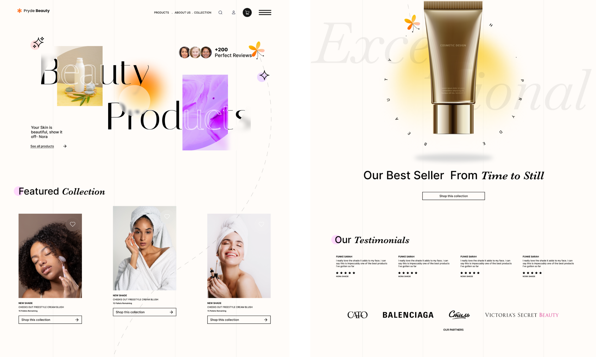

# 🌐 Responsive Portfolio Website

## 🙋‍♂️ Note from the Developer

I'm not a professional developer — I'm still learning and building my skills.  
This project was made as part of my personal learning journey.  
🌓 It supports **dark mode**, and will automatically follow your device's theme settings.

===I'm always open to feedback or tips on how to improve. Thanks for checking it out!===


A sleek, fully responsive personal portfolio website built using **HTML**, **TailwindCSS**, and **JavaScript**. Features animated scroll effects, dark mode support, and a clean UI optimized for all devices.



## 🚀 Tech Stack
- HTML
- TailwindCSS
- JavaScript
- AOS (Animate On Scroll)
- Dark Mode Toggle

## ✨ Features
- Responsive design across all screen sizes
- Scroll animations with AOS
- Dark/light mode toggle synced with system preferences
- Follows your device's **dark mode** settings automatically
- Beautiful project cards with hover effects
- Mobile-friendly navigation

## 🔧 Setup Instructions
1. Clone the repository:
   ```bash
   git clone https://github.com/yourusername/portfolio-website.git
